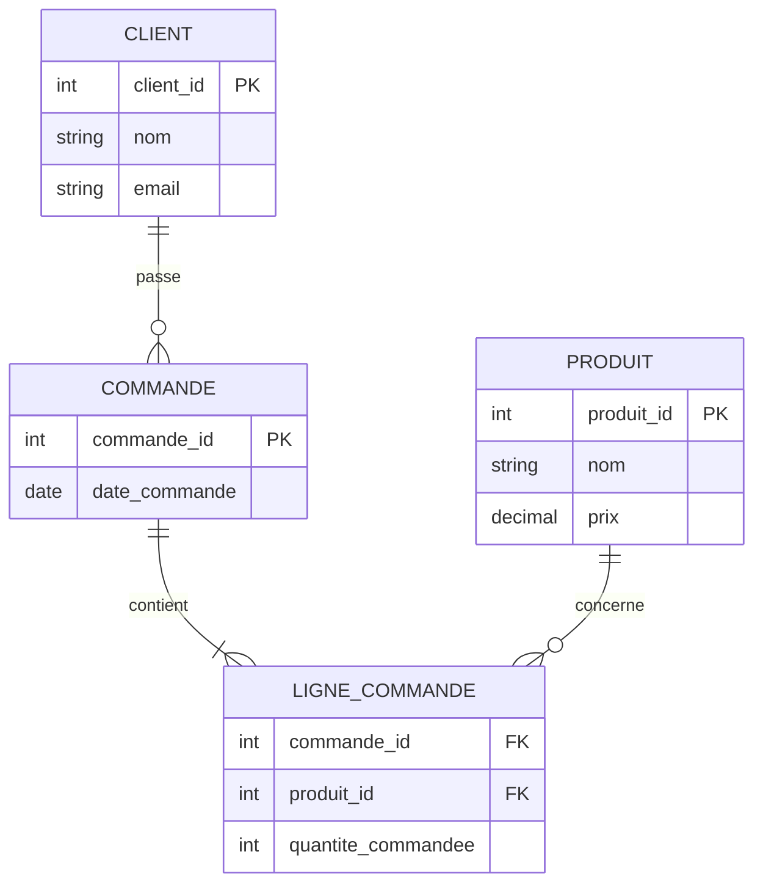

# Associations & Cardinalities

```mermaid
erDiagram

    CLIENT ||--o{ COMMANDE : "passe"
    COMMANDE ||--|{ LIGNE_COMMANDE : "contient"
    PRODUIT ||--o{ LIGNE_COMMANDE : "concerne"

    CLIENT {
        int client_id PK
        string nom
        string email
    }

    COMMANDE {
        int commande_id PK
        date date_commande
    }

    PRODUIT {
        int produit_id PK
        string nom
        decimal prix
    }

    LIGNE_COMMANDE {
        int commande_id FK
        int produit_id FK
        int quantite_commandee
    }
```